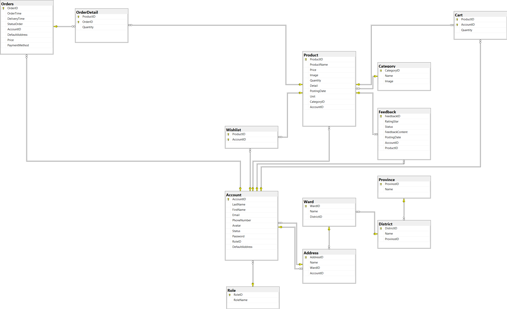

# Website bán hàng nông sản

## Mô tả

Website có những chức năng chính sau
| Chức năng | Mô tả chi tiết |
| ------------------------ | ----------- |
| Đăng ký tài khoản mới | Nếu chưa có tài khoản, khách hàng có thể đăng ký tài khoản mới. |
| Đăng nhập | Đăng nhập vào tài khoản của mình thực hiện những chức năng được cho phép. |
| Quên mật khẩu | Lấy lại mật khẩu khi quên bằng cách xác nhận email |
| Xem sản phẩm | Người dùng có thể xem chi tiết sản phẩm, bao gồm: mô tả, giá cả, hình ảnh, đánh giá,… |
| Tìm kiếm, lọc sản phẩm | Lọc & tìm kiếm sản phẩm theo từ khóa hoặc danh mục, giá...|
| Quên mật khẩu | Lấy lại mật khẩu khi quên bằng cách xác nhận email |
| Thay đổi thông tin cá nhân | Người dùng có thể thay đổi thông tin cá nhân như: hình ảnh, email, số điện thoại, họ tên, địa chỉ,… |
| Thêm SP vào giỏ hàng |Thêm sản phẩm vào giỏ hàng phục vụ cho mục đích đặt hàng|
| Thêm SP vào mục yêu thích | Giúp việc tìm lại sản phẩm dễ dàng hơn cho lần mua sau |
| Thanh toán, hủy đơn hàng | Thực hiện thanh toán, hủy đơn hàng khi đơn chưa được xác nhận |
| Quản lý đơn hàng | Admin cập nhật tình trạng đơn hàng sau khi khách hàng đặt hàng. |
| Đánh giá | Khách hàng đánh giá sản phẩm sau khi mua hàng. |
| Quản lý khách hàng | Xóa/khóa tài khoản khách hàng nếu họ vi phạm |
| Quản lý category, Products | CRUD Categories, Products |

## Xác định thực thể
Quy ước
- Khóa chính: In đậm.
- Khóa ngoại: in đậm và viết nghiêng.

Account (**Account_ID**, First_Name, Last_Name, Email, Phone, Avatar, Status, Password, **_Role_ID_**, **_Address_ID_**)

Role (**Role_ID**, Role_Name)

Category (**Category_ID**, Category_Name, Image)

Address (**Address_ID**, Address_Name, **_WardID_**, **_Account_ID_**)

Ward (**WardID**, Name, **_DistrictID_**)

District (**DistrictID**, Name, **_ProvinceID_**)

Province (**ProvinceID**, Name)

Product (**Product_ID**, Product_Name, Price, Image, Quantity, Detail, Posting_Date, Unit, **_Category_ID_**, **_Account_ID_**, Status)

Cart (**Product_ID**, **Account_ID**, Quantity)
- Bảng Cart có ``Product_ID`` và ``Account_ID`` là PK và FK 

Orders (**Order_ID**, Order_Time, Order_Status, **_Address_ID_**, **_Account_ID_**, Total_Price)	

Order_Detail (**Order_ID**, **Product_ID**, Quantity, Product_Unit_Price)
- Bảng Order_Detail có ``Product_ID`` và ``Order_ID`` là PK và FK 

Wishlist (**Account_ID**, **Product_ID**)
- Bảng Wishlist có ``Product_ID`` và ``Account_ID`` là PK và FK 

Feedback (**Feedback_ID**, Star, Status, Feedback_Content, Posting_Date, **_Account_ID_**, **_Product_ID_**)

## Biểu đồ diagram

## Mô hình thực thể quan hệ (Entity Relationship Diagram - ERD)
